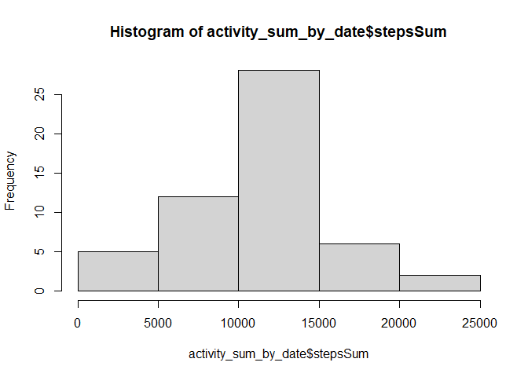
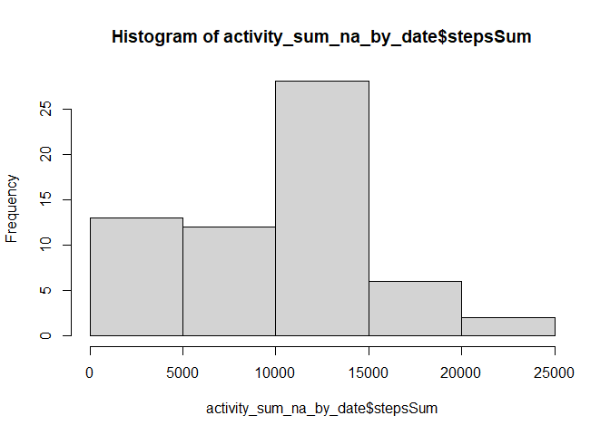
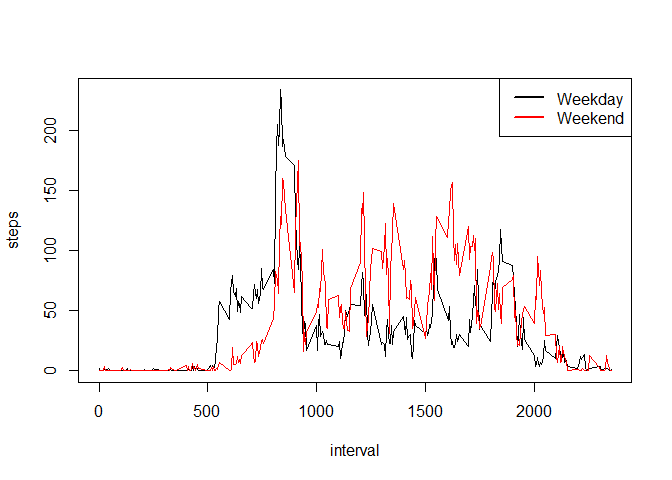

1. Code for reading in the dataset and/or processing the data
-------------------------------------------------------------

    library(dplyr)

    ## 
    ## Attaching package: 'dplyr'

    ## The following objects are masked from 'package:stats':
    ## 
    ##     filter, lag

    ## The following objects are masked from 'package:base':
    ## 
    ##     intersect, setdiff, setequal, union

    filename <- "RepData.zip"

    # Checking if zip-file already exists.
    if (!file.exists(filename)){
          fileURL <- "https://d396qusza40orc.cloudfront.net/repdata%2Fdata%2Factivity.zip"
          download.file(fileURL, filename, method="curl")
    }  

    # Checking if un-zipped file exists
    if (!file.exists("activity.csv")) { 
          unzip(filename) 
    }

    #Read data from activity.csv
    activity<-read.csv("activity.csv")

    activity$date<-as.Date(activity$date, "%Y-%m-%d")

    head(activity)

    ##   steps       date interval
    ## 1    NA 2012-10-01        0
    ## 2    NA 2012-10-01        5
    ## 3    NA 2012-10-01       10
    ## 4    NA 2012-10-01       15
    ## 5    NA 2012-10-01       20
    ## 6    NA 2012-10-01       25

2. Histogram of the total number of steps taken each day
--------------------------------------------------------

    activity_by_date<-group_by(activity, date)

    activity_sum_by_date<-summarise(activity_by_date, stepsSum=sum(steps))

    ## `summarise()` ungrouping output (override with `.groups` argument)

    hist(x=activity_sum_by_date$stepsSum)

3. Mean and median number of steps taken each day
-------------------------------------------------

    summary(activity_sum_by_date$stepsSum)

    ##    Min. 1st Qu.  Median    Mean 3rd Qu.    Max.    NA's 
    ##      41    8841   10765   10766   13294   21194       8

4. Time series plot of the average number of steps taken
--------------------------------------------------------

    steps_by_interval <- aggregate(steps ~ interval, activity, mean)

    plot(steps_by_interval$interval, steps_by_interval$steps, type='l', 
         main="Average number of steps over all days", xlab="Interval", 
         ylab="Average number of steps")

5. The 5-minute interval that, on average, contains the maximum number of steps
-------------------------------------------------------------------------------

    # find row with max of steps
    max_steps_row <- which.max(steps_by_interval$steps)

    # find interval with this max
    steps_by_interval[max_steps_row, ]

    ##     interval    steps
    ## 104      835 206.1698

6. Code to describe and show a strategy for imputing missing data
-----------------------------------------------------------------

1.  Calculate and report the total number of missing values in the
    dataset (i.e. the total number of rows with NAs).

<!-- -->

    sum(is.na(activity))

    ## [1] 2304

1.  Devise a strategy for filling in all of the missing values in the
    dataset. The strategy does not need to be sophisticated. For
    example, you could use the mean/median for that day, or the mean for
    that 5-minute interval, etc

2.  Create a new dataset that is equal to the original dataset but with
    the missing data filled in.

7. Histogram of the total number of steps taken each day after missing values are imputed
-----------------------------------------------------------------------------------------

    activity_sum_na_by_date<-summarise(activity_by_date, stepsSum=sum(steps, na.rm = TRUE))

    ## `summarise()` ungrouping output (override with `.groups` argument)

    hist(x=activity_sum_na_by_date$stepsSum)

8. Panel plot comparing the average number of steps taken per 5-minute interval across weekdays and weekends
------------------------------------------------------------------------------------------------------------

    activity_by_date$weekday <- weekdays(as.Date(activity_by_date$date))

    activity_by_date$typeday <- "weekday"

    activity_by_date$typeday[activity_by_date$weekday %in% c('Saturday','Sunday')] <- "weekend"

    activity_by_date_week <- aggregate(steps ~ interval + typeday, data=activity_by_date, mean)

    activity_by_date_weekday <- subset(activity_by_date_week, 
                                       activity_by_date_week$typeday=="weekday")
    activity_by_date_weekend <- subset(activity_by_date_week, 
                                       activity_by_date_week$typeday=="weekend")

    with(activity_by_date_weekday, plot(steps ~ interval, type = "l"))

    with(activity_by_date_weekend, lines(steps ~ interval, type = "l", col = "red"))

    legend("topright", col=c("black", "red"), lty = 1, lwd = 2, 
           legend = c("Weekday", "Weekend"))

9. All of the R code needed to reproduce the results (numbers, plots, etc.) in the report
-----------------------------------------------------------------------------------------
